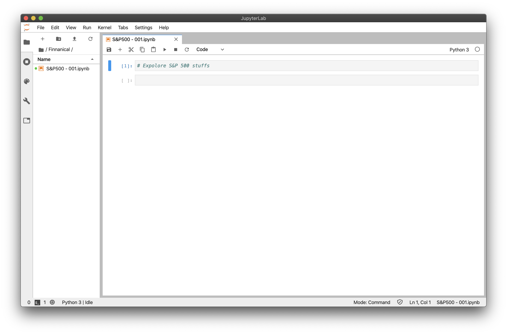

# Jupyter Lab App

A simple electron app for Jupyter Lab, because that's all I wanted

Based on the wonderful quick start eletron app: https://github.com/electron/electron-quick-start

Cheers!

## To use
All you need to do in clone the repo and then run `npm install` + `npm build`.

Once it boots for the first time if you have Jupyter Lab running in the background it'll ask for your token once, and thats it!

## Good to know

This allows you to do other helpful things like override keyboard shortcuts that would otherwise be reserved for your browser, such as easily switching tabs:

### keyboard user settings
```
{
    "shortcuts": [
        {
            "command": "application:activate-next-tab",
            "keys": [
                "Accel Shift ]"
            ],
            "selector": "body"
        },
        {
            "command": "application:activate-previous-tab",
            "keys": [
                "Accel Shift ["
            ],
            "selector": "body"
        }
    ]
}
```
